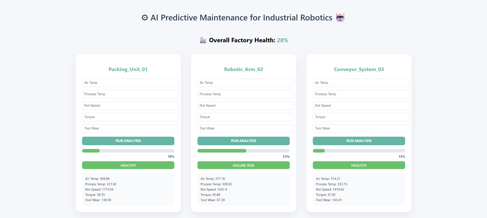
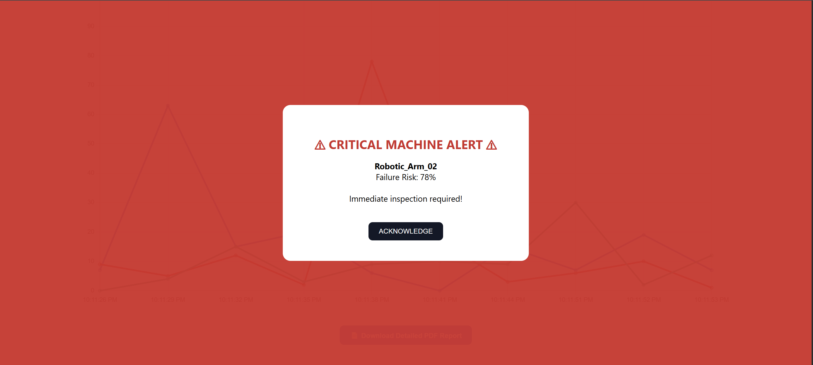
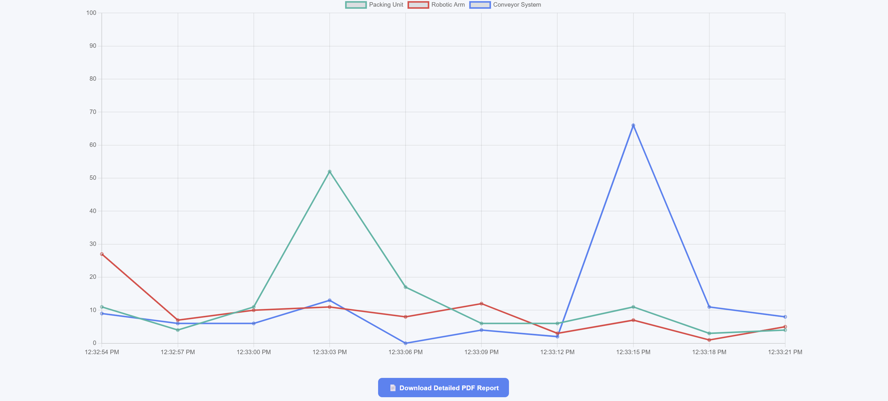

# Predictive Maintenance using Machine Learning

This project predicts industrial machine failures using a Machine Learning model and provides a web interface built with Flask to visualize predictions.

## Features

* Machine failure prediction
* Interactive dashboard
* Failure risk alerts
* Sensor data visualization

## Technologies Used

* Python
* Flask
* Scikit-learn
* Pandas
* HTML / CSS / JavaScript

## Project Screenshots

### Dashboard


### Failure Alert


### Data Visualization


## How to Run

1. Install dependencies

```
pip install -r requirements.txt
```

2. Run the application

```
python app.py
```

3. Open in browser

```
http://127.0.0.1:5000
```

## Author

Kovvuri Karthikeya
B.Tech CSE – KL University
